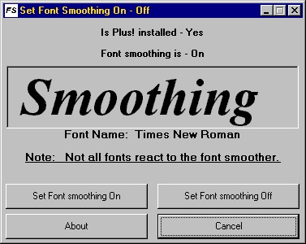



## Set Font Smoothing On/Off

### Description

This sample shows how to

See if Plus! is installed and

how to turn Font smoothing On Or Off

Enjoy!
 
### More Info
 

             |
---                |---
**Submitted On**   |2000-07-14 20:22:34
**By**             |[MDSW](https://github.com/Planet-Source-Code/PSCIndex/blob/master/ByAuthor/mdsw.md)
**Level**          |Intermediate
**User Rating**    |5.0 (15 globes from 3 users)
**Compatibility**  |VB 3\.0, VB 4\.0 \(16\-bit\), VB 4\.0 \(32\-bit\), VB 5\.0, VB 6\.0, VB Script, ASP \(Active Server Pages\) 
**Category**       |[Miscellaneous](https://github.com/Planet-Source-Code/PSCIndex/blob/master/ByCategory/miscellaneous__1-1.md)
**World**          |[Visual Basic](https://github.com/Planet-Source-Code/PSCIndex/blob/master/ByWorld/visual-basic.md)
**Archive File**   |[CODE\_UPLOAD78017142000\.zip](https://github.com/Planet-Source-Code/mdsw-set-font-smoothing-on-off__1-9781/archive/master.zip)

